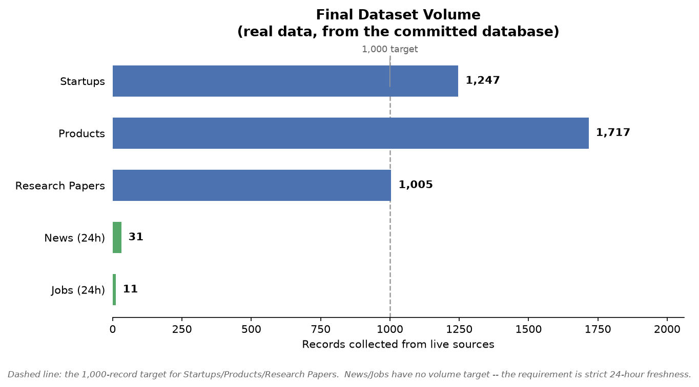
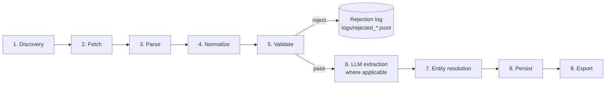

# AI Intelligence Ingestion Pipeline

**A production-oriented asynchronous data pipeline for ingesting, validating, enriching, resolving, and exporting AI-ecosystem intelligence — startups, products, research papers, news, and jobs — from legitimate public sources.**


[Repository](https://github.com/chittalasailu/ai-intelligence-ingestion-pipeline) · [Architecture Document (PDF)](architecture.pdf) · [Limitations](docs/LIMITATIONS.md) · [Google Sheets Setup](docs/GOOGLE_SHEETS_SETUP.md)

There is no CI badge here because no CI workflow is configured in this repository — every number on this page comes from actually running the code locally and reading the output, not from an automated pipeline. That distinction matters more here than usual: see [Data Quality](#data-quality).

## Table of Contents

- [Overview](#overview)
- [Key Results](#key-results)
- [Architecture](#architecture)
- [Data Flow](#data-flow)
- [Sources, Processing, and Output](#sources-processing-and-output)
- [Architecture Details](#architecture-details)
- [Scaling to 500,000+ Records](#scaling-to-500000-records)
- [Reliability](#reliability)
- [Data Quality](#data-quality)
- [Security](#security)
- [Quick Start](#quick-start)
- [Project Structure](#project-structure)
- [Testing](#testing)
- [Output Examples](#output-examples)
- [Key Engineering Decisions](#key-engineering-decisions)
- [Trade-offs and Limitations](#trade-offs-and-limitations)
- [Observability](#observability)
- [Deliverables](#deliverables)

## Overview

GraphOne / FrontierAtlas is building an intelligence graph over the AI and venture ecosystem. This pipeline is a working implementation of the ingestion layer such a graph depends on: it continuously pulls structured and unstructured data about **startups**, **products**, **research papers**, **AI jobs**, and **AI news** from public APIs, RSS feeds, and open datasets, then pushes every record through the same pipeline stage by stage:

```
discovery → async crawling → extraction → normalization → validation
   → LLM structuring (where applicable) → entity resolution
   → persistence → export
```

The engineering challenge isn't fetching data — it's fetching it **reliably, at volume, without fabricating anything** when a source is slow, rate-limited, malformed, or simply wrong. Every design decision in this repository — the retry/backoff strategy, the checkpointing, the entity-resolution threshold, the schema validation gate — exists because a real failure mode showed up while building against live sources, not because it looked good in a design doc. Several of those failures, and the fixes they produced, are documented with the same honesty as the successes — see [Trade-offs and Limitations](#trade-offs-and-limitations).

## Key Results

Produced by running this exact code against live sources on 2026-09-04. Every row traces to a real, checkable URL — see [Data Quality](#data-quality) for how that's enforced, not just claimed.



| Metric | Result |
|---|---:|
| Startups (target: 1,000+) | **1,247** ✅ |
| Products (target: 1,000+) | **1,717** ✅ |
| Research papers (target: 1,000+) | **1,005** ✅ |
| Fresh AI news (≤24h, no minimum required) | **31** |
| Fresh AI jobs (≤24h, no minimum required) | **11** |
| Entity mapping log (full audit trail) | **2,453** |
| Automated tests | **138 / 138 passing** |
| Fabricated records | **0** |

News and jobs have no volume target in this project's spec — the requirement is that everything retained is genuinely published within the last 24 hours, which 750 of 761 job postings and most discovered news items did *not* satisfy on the day this was run (see [Reliability](#reliability)). A low count there is the freshness gate working, not a shortfall.

## Architecture

```mermaid
flowchart TD
    subgraph Sources["Public Sources (no auth, no bot bypass)"]
        direction LR
        S1[arXiv API]
        S2[Hugging Face<br/>Daily Papers]
        S3[YC OSS<br/>startup directory]
        S4[5x AI news<br/>RSS feeds]
        S5[5x job boards<br/>RemoteOK / Greenhouse]
        S6[GitHub REST API<br/>star counts]
    end

    Sources --> Crawler

    Crawler["Async Crawler — src/crawler, src/utils/http_client.py<br/>aiohttp connection pooling · bounded concurrency (global + per-host)<br/>exponential backoff + jitter · checkpointed & resumable · failure-isolated"]

    Crawler --> Extract

    Extract["Extraction — src/extractors/*<br/>HTML cleanup & paragraph-aware chunking · RSS/JSON parsing<br/>date normalization (ISO/RFC-822/epoch/relative) · full-text capture"]

    Extract --> Validate

    Validate["Validation — src/schemas/validation.py<br/>pydantic schema check · URL validation<br/>24h freshness gate · content-hash + DB-constraint dedup<br/>reject-and-log, never silently drop"]

    Validate -->|structured data already| Resolve
    Validate -->|raw text needing structure| LLM

    LLM["LLM Orchestrator — src/llm/*<br/>Gemini → Groq → DeepSeek fallback chain<br/>intelligent chunking · 413 shrink-and-retry · 429 backoff-and-fallback<br/>deterministic keyword fallback when no provider configured"]

    LLM --> Resolve

    Resolve["Entity Resolution — src/entity_resolution/*<br/>normalize → 55-entity seed/alias exact match → fuzzy match (97% threshold)<br/>full raw→canonical audit log with method + confidence"]

    Resolve --> Storage

    Storage[("Storage — src/storage/*<br/>SQLAlchemy async ORM<br/>SQLite (demo) ⇄ PostgreSQL (DATABASE_URL swap)")]

    Storage --> Export

    Export["Export — src/export/*<br/>CSV per tab · combined XLSX workbook · Google Sheets (6 tabs)"]
```



*(GitHub renders the diagram above natively. A textual walkthrough of each stage is in [Architecture Details](#architecture-details); the full 2-page design document — scale strategy, storage justification, distributed dedup — is [architecture.pdf](architecture.pdf).)*

## Data Flow



1. **Discovery** — enumerate candidates: arXiv category pages, the YC directory snapshot, RSS feed items, job-board listings.
2. **Fetch** — `AsyncHttpClient` (pooled aiohttp) retrieves each candidate with bounded concurrency and retry/backoff.
3. **Parse** — source-specific extractors turn HTML/RSS/JSON into typed intermediate objects (`ArxivPaper`, `YcCompany`, `RawJob`, ...).
4. **Normalize** — dates to UTC ISO-8601, HTML to cleaned text, names to a comparison form.
5. **Validate** — pydantic schema check, URL validation, 24h freshness gate (news/jobs), dedup. Failures are logged with a reason, never silently dropped.
6. **LLM extraction** — for unstructured text (job descriptions, pricing pages), the multi-tier provider chain (or its deterministic fallback) produces the structured field.
7. **Entity resolution** — canonicalize the company/startup name.
8. **Persist** — insert into the database behind a content-hash unique constraint (second dedup layer).
9. **Export** — CSV/XLSX/Sheets, always read from the database so a resumed run's export never shrinks.

## Sources, Processing, and Output

| Domain | Sources (all implemented) | Processing | Output record |
|---|---|---|---|
| Startups | YC OSS open directory (`yc-oss.github.io`) | AI-tag filter → entity resolution | `STARTUP` |
| Products | Each startup's own live website | HTML fetch → pricing-page path guessing → keyword/LLM pricing classification → entity resolution | `PRODUCT` |
| Research papers | arXiv API, Hugging Face Daily Papers | Metadata fetch → author-declared GitHub link extraction → GitHub star lookup | `RESEARCH_PAPER` |
| News | 5 RSS feeds (TechCrunch AI, Ars Technica, The Verge AI, MIT Tech Review AI, Wired AI) | Feed parse → full-text fetch → 24h freshness gate | `NEWS` |
| Jobs | 5 job boards (RemoteOK, WeWorkRemotely, 3× Greenhouse) | API/RSS fetch → role classification → 24h freshness gate | `JOB` |

## Architecture Details

**Async ingestion.** Every network call goes through one `AsyncHttpClient` (`src/utils/http_client.py`): a pooled `aiohttp.TCPConnector`, gated by two `asyncio.Semaphore` layers — a global concurrency cap and a per-host cap, so one slow host can't starve a batch. `run_bounded()` (`src/crawler/base.py`) wraps every crawl loop, fanning work out to at most N in-flight coroutines with a try/except around each item — one malformed record can't abort a run. Politeness-constrained sources (arXiv's API terms ask for ~1 request/3s) are the deliberate exception: pagination there is sequential, but the *post-processing* of each page (GitHub lookups, validation, DB writes) still fans out through the same bounded runner.

**Checkpointing & resumability.** `CheckpointStore` (`src/utils/checkpoint.py`) is a WAL-mode SQLite table keyed by `(namespace, item_id)`. A killed run resumes without re-fetching or re-emitting anything already processed. A row is marked seen **only after its database insert commits** — marking first would permanently skip an item on resume if the insert then failed, which is exactly the bug a real run surfaced during development (see [Trade-offs and Limitations](#trade-offs-and-limitations)).

**Deduplication.** Two independent layers: checkpoint dedup (per source ID/URL, catches re-fetches) and content-hash dedup (`src/utils/dedup.py`, SHA-256 of normalized text — catches the same story syndicated to two outlets, or a job cross-posted to two boards, which URL-based dedup alone would miss). A third layer is a `dedup_key` unique constraint on every database table, so even a logic gap upstream can't produce a duplicate row.

**Freshness (24-hour news/jobs).** `src/utils/freshness.py` normalizes ISO-8601, RFC-822/RSS `pubDate`, epoch seconds/millis, and relative strings ("2 hours ago") to UTC. `is_fresh()` returns `False` for anything unparseable — a date the code can't determine is *never* treated as fresh. The one documented heuristic fallback (for a source with no timestamp at all) only fires against real prior-crawl checkpoint state, and explicitly refuses to mark anything fresh on that source's first-ever run, so a full backlog can't flood in as false-fresh on day one.

**LLM orchestration.** Gemini → Groq → DeepSeek, each an interchangeable adapter behind one interface (`LLMProvider.call`). `LLMOrchestrator.configured_providers` filters out any tier with no API key, so the chain degrades gracefully — down to zero configured providers, where deterministic keyword-based fallbacks (pricing/role classification) keep the pipeline producing valid output. On **429**: exponential backoff + jitter, honoring a `Retry-After` header when sent; exhausting the retry budget on one provider falls through to the next tier. On **413**: the payload is never blindly truncated — `shrink_for_413()` halves the token budget and retries the *same* provider before falling through, so a smaller-context provider doesn't fail the whole extraction. On timeout or any other provider error: logged, and the chain falls through immediately.

**Chunking.** `src/utils/chunking.py` strips boilerplate (script/style/nav/footer/ads by tag and class heuristics), locates the main content block, then packs paragraphs into token-budgeted chunks (~4 chars/token estimate) with overlap across boundaries — and always prepends the lead paragraph to every chunk, so a fallback provider that only ever sees chunk 2 still has the headline context.

**Entity resolution.** Unicode NFKD normalize → lowercase → strip punctuation → collapse whitespace → strip a trailing *legal* suffix (Inc/LLC/Corp/GmbH) iteratively — deliberately excluding brand words like "Labs"/"Technologies", since auto-stripping those raises false-merge risk. Exact match against a 55-entity seed+alias table → alias table → fuzzy match (`rapidfuzz.token_sort_ratio`) at a 97% confidence threshold. That threshold is not a guess — see [Trade-offs and Limitations](#trade-offs-and-limitations) for the real false-merge audit that produced it. Every resolution, including "no match, new canonical," is written to an audit log (raw name, canonical name, method, confidence, source URL, timestamp).

**Storage.** SQLite for this demo (zero setup, `DATABASE_URL` default) against the exact same SQLAlchemy models that run on PostgreSQL in production (`DATABASE_URL=postgresql+asyncpg://...`, `docker-compose.yml` provisions one with `pgvector` pre-installed). See [Scaling](#scaling-to-500000-records) for why Postgres, and why `pgvector` rather than a separate graph database.

## Scaling to 500,000+ Records

**What exists today:** a working pipeline that has genuinely ingested 1,000-1,700-record volumes per vertical, checkpointed, deduplicated, and validated, on a single machine.

**What would change to reach 500,000+ — configuration and infrastructure, not a rewrite:**

- **Concurrency is already a config value**, not a code path. `MAX_CONCURRENCY` / `PER_HOST_CONCURRENCY` are the only knobs `AsyncHttpClient` reads; raising them, plus running more worker processes/containers each with their own budget, is most of the scale-up story.
- **Partitioning is a checkpoint-namespace split.** `CheckpointStore` already keys state per source; splitting one source's ID space (arXiv categories, YC batches, alphabetic shards of a company list) across N workers — each with its own namespace, or a shared Postgres checkpoint table in production — turns one crawler into a fleet without touching extraction logic.
- **Storage swaps via one environment variable.** The SQLAlchemy models are unchanged between SQLite and Postgres.
- **Orchestration**, at real scale, becomes N worker pods (Kubernetes Jobs or a Celery/RQ queue) reading partitioned work from a queue, each running the identical `run_bounded()`-based extractor against the same Postgres primary, with a scheduler (Airflow/Dagster) handling retry-the-whole-partition semantics on top of the per-item retries already built in.
- **Provider rate limits are global, not per-worker** — at fleet scale, LLM tier concurrency needs a shared token-bucket (Redis) rather than each worker enforcing its own limit independently.
- **Idempotency and distributed dedup** already work the way they'd need to at scale: a row is only marked processed after its insert commits, and the content-hash + DB-unique-constraint layers don't care which worker wrote first.

This laptop run is not processing 500,000 records — it's demonstrating the exact mechanisms (bounded concurrency, checkpointing, idempotent writes, config-driven limits) that make the 500k target an infrastructure problem instead of an application rewrite. The full reasoning, plus the distributed-freshness story, is in [architecture.pdf](architecture.pdf).

## Reliability

| Mechanism | Where | What it does |
|---|---|---|
| Retry + exponential backoff + jitter | `src/utils/retry.py` | Shared by the HTTP crawler and the LLM layer — one implementation, not reimplemented per call site |
| Timeout handling | `src/utils/http_client.py` | A dead host, DNS failure, or timeout becomes a status code the caller checks — `fetch()` never raises |
| 413 handling | `src/llm/orchestrator.py`, `src/utils/chunking.py` | Chunk before sending; shrink and retry if still too large; fall through to the next provider tier |
| 429 handling | `src/utils/retry.py`, `src/llm/orchestrator.py` | Backoff honoring `Retry-After`; fall through to the next provider tier rather than hammering |
| Checkpointing & resumability | `src/utils/checkpoint.py` | A killed run resumes without re-fetching or re-emitting anything already committed |
| Failure isolation | `src/crawler/base.py::run_bounded` | Per-item try/except — one bad record can't abort a batch |
| Structured logging | `src/utils/logging_setup.py` (structlog, JSON) | Every run emits discovered/fetched/validated/rejected/duplicate/retry counters |
| Schema validation | `src/schemas/validation.py` | Nothing reaches storage or export without passing a pydantic model check |
| Rejected-record logging | `src/schemas/validation.py::RejectionLog` | Every rejection is logged with a reason and source URL, never silently dropped |
| Graceful shutdown | `src/crawler/base.py::GracefulShutdown` | Cooperative flag checked before each new task starts; wired to SIGINT/SIGTERM on POSIX, falls back to a top-level `KeyboardInterrupt` handler on Windows |

## Data Quality

Every record passes through `validate_record()` before it can reach storage or export. A record is rejected — logged to `logs/rejected_<run_id>.jsonl` with a reason, never silently dropped — when:

- its source URL fails a `pydantic.HttpUrl` check,
- a required field is missing or the wrong type,
- `recordType` doesn't match the model,
- `pricingModel` isn't one of `FREE | FREEMIUM | PAID | ENTERPRISE`,
- a news/job item's publish date is missing, unparseable, or outside the 24-hour window,
- it duplicates an existing `dedup_key`.

**Source traceability**: every record carries its originating `source.name`/`source.url` end to end. Research-paper GitHub links are the strictest case — a repo is attached to a paper only when that paper's own abstract/comment field contains the *exact* URL (`is_valid_github_evidence`), never inferred from title similarity; the field is `null`, not a guess, when no such evidence exists.

**GitHub verification**: star counts come from a live call to the GitHub REST API, cached to disk (`data/mappings/github_stars_cache.json`) so a repeat run costs zero extra requests. Unauthenticated access is 60 requests/hour, shared per IP — once exhausted, the client stops issuing requests and leaves `github_stars` empty rather than guessing.

**No synthetic records are used to satisfy target counts.** Where a legitimate source couldn't reach a target on its own (Products, initially at 768 — see [Trade-offs and Limitations](#trade-offs-and-limitations)), the fix was to widen the legitimate candidate pool and improve extraction, not to fabricate rows.

## Security

- **No secrets in source control.** `.env.example` documents every variable with a safe empty/default value; `.gitignore` excludes `.env`, `service-account.json`, `credentials.json`, `*.pem`/`*.key`, and every database/cache file. Verified before every push with a pattern scan for API-key-shaped strings (Google, OpenAI-style, Groq, GitHub, AWS) across the tracked tree — none found, ever, in this repository's history.
- **Credential handling**: LLM keys and the GitHub token are read from environment variables only (`src/utils/config.py`); nothing is hard-coded. Google Sheets access uses either a service-account JSON file (never committed) or Application Default Credentials — see `docs/GOOGLE_SHEETS_SETUP.md`.
- **Repository hygiene**: `.venv/`, `__pycache__/`, `.pytest_cache/`, and the local SQLite database are all gitignored; the shipped `data/*.csv` files are the actual output, not working state.

## Quick Start

```bash
git clone https://github.com/chittalasailu/ai-intelligence-ingestion-pipeline.git
cd ai-intelligence-ingestion-pipeline
python -m venv .venv
# Windows: .venv\Scripts\activate      macOS/Linux: source .venv/bin/activate
pip install -r requirements.txt
cp .env.example .env
```

`.env` works as-is for a demo run — every field has a safe default (SQLite, no LLM keys). Every command below has actually been run against this repository; none are illustrative.

```bash
# Run everything
python -m src.main --pipeline all

# One vertical at a time
python -m src.main --pipeline startups --startups-target 1000
python -m src.main --pipeline products --products-target 1000
python -m src.main --pipeline research_papers --papers-target 1000
python -m src.main --pipeline news
python -m src.main --pipeline jobs

# Re-export the current database to CSV/XLSX (and optionally Sheets)
# without re-running any crawler
python -m scripts.export_data
python -m scripts.export_data --sheets

# Tests
pytest -q
```

## Project Structure

```
ai-intelligence-ingestion-pipeline/
├── README.md
├── architecture.pdf
├── requirements.txt
├── .env.example
├── .gitignore
├── docker-compose.yml            # PostgreSQL + pgvector, production target
├── pytest.ini
│
├── config/
│   ├── settings.yaml              # concurrency, thresholds, LLM chain order
│   └── sources.yaml                # every source URL — swap sources without touching code
│
├── src/
│   ├── crawler/         base.py                  bounded concurrency, failure isolation, graceful shutdown
│   ├── extractors/      arxiv.py, github_stars.py, hf_papers.py, jobs.py,
│   │                    news_rss.py, product_pricing.py, yc_startups.py
│   ├── llm/             base.py, providers.py, orchestrator.py, factory.py
│   ├── entity_resolution/  normalizer.py, resolver.py, seed_data.py, mapping_log.py
│   ├── pipelines/       one file per vertical + context.py (shared run state)
│   ├── schemas/         models.py (pydantic), validation.py
│   ├── storage/         models.py (SQLAlchemy), db.py, repository.py
│   ├── export/          tabular.py (CSV/XLSX), google_sheets.py
│   ├── utils/           http_client.py, retry.py, chunking.py, freshness.py,
│   │                    checkpoint.py, dedup.py, config.py, logging_setup.py, role_family.py
│   └── main.py           CLI entrypoint
│
├── tests/                16 files, 138 tests
├── scripts/              export_data.py, build_architecture_pdf.py
├── docs/                 GOOGLE_SHEETS_SETUP.md, LIMITATIONS.md, images/
└── data/                 startups/ products/ research/ jobs/ news/ mappings/
```

*(This tree reflects `git ls-files` at the current commit — it is not hand-typed.)*

## Testing

```
$ pytest -q
........................................................................ [ 52%]
......................................................................  [100%]
138 passed, 10 warnings in ~20s
```

| Area | Test file(s) |
|---|---|
| Date parsing & freshness | `test_freshness.py` |
| Entity normalization & matching (incl. 8 real false-merge regression cases) | `test_entity_resolution.py` |
| Schema validation | `test_schemas.py` |
| Chunking (token budgeting, 413 shrink) | `test_chunking.py` |
| Retry/backoff/jitter | `test_retry.py` |
| Deduplication | `test_dedup.py`, `test_checkpoint.py` |
| Pricing heuristic (incl. path-guessing, HTTP fallback) | `test_product_pricing.py` |
| Mapping-log cross-process dedup | `test_mapping_log.py` |
| YC candidate-pool filtering | `test_yc_startups.py` |
| Bounded concurrency & failure isolation | `test_crawler_base.py` |
| LLM fallback chain (mocked HTTP: success, 429 exhaustion, 413 shrink, no-provider) | `test_llm_orchestrator.py` |
| GitHub star lookup + caching | `test_github_stars.py` |
| Google Sheets credential resolution (service account + ADC) | `test_google_sheets.py` |
| Real SQLite round-trip (datetime types, dedup constraints) | `test_repository.py` |
| Full pipeline flow against a mocked arXiv response | `test_pipeline_integration.py` |

Several of these tests exist *because* running the pipeline against real sources surfaced real bugs during development — a stats-reporter crash, a Windows/aiodns incompatibility, a BeautifulSoup mutate-while-iterating crash, a SQLite concurrency error, a checkpoint-ordering data-loss bug, a datetime/string type mismatch, and the entity-resolution false merges below. Each one is now a regression test, not just a fix.

## Output Examples

Real records from the committed database, formatted to the nested schema (the CSV export flattens these for spreadsheet use — see `src/pipelines/common.py`).

<details>
<summary><b>STARTUP</b></summary>

```json
{
  "schemaVersion": "1.0",
  "recordType": "STARTUP",
  "source": { "name": "YC OSS Startup Directory", "url": "https://www.ycombinator.com/companies/semantics3" },
  "content": { "entityName": "Semantics3", "data": { "employeeCount": 25 } },
  "collectedAt": "2026-09-04T11:45:54.868305Z"
}
```
</details>

<details>
<summary><b>PRODUCT</b></summary>

```json
{
  "schemaVersion": "1.0",
  "recordType": "PRODUCT",
  "source": { "name": "YC OSS Startup Directory (product surface)", "url": "https://opencurriculum.org/" },
  "content": { "startupName": "OpenCurriculum", "pricingModel": "FREEMIUM" },
  "collectedAt": "2026-09-04T11:46:25.805743Z"
}
```
</details>

<details>
<summary><b>RESEARCH_PAPER</b> (with author-declared GitHub repo)</summary>

```json
{
  "schemaVersion": "1.0",
  "recordType": "RESEARCH_PAPER",
  "content": {
    "title": "SWE-Gate: Passing Functional Tests Is Not Enough for Software Engineering Agents",
    "authors": ["Xin He", "Yanlin Wang", "Mingwei Liu", "Jiachi Chen", "Hongyu Zhang", "Guanbin Li"],
    "paper_url": "https://arxiv.org/abs/2609.04167v1",
    "github_url": "https://github.com/DeepSoftwareAnalytics/SWE-Gate",
    "github_stars": 0,
    "published_date": "2026-09-03T17:53:34Z"
  }
}
```
</details>

<details>
<summary><b>JOB</b></summary>

```json
{
  "schemaVersion": "1.0",
  "recordType": "JOB",
  "source": { "name": "Greenhouse - Anthropic", "url": "https://job-boards.greenhouse.io/anthropic/jobs/5416059008" },
  "content": {
    "company": "Anthropic",
    "date": "2026-09-03T22:10:15Z",
    "is_remote": false,
    "role_family": "Engineering",
    "title": "TPM Manager, Infrastructure"
  },
  "collectedAt": "2026-09-04T11:47:02.234283Z"
}
```
</details>

<details>
<summary><b>Entity resolution example</b> (real raw → canonical mapping)</summary>

```
raw_name,canonical_name,method,confidence,source_url
Jasper.ai,Jasper,alias,100.0,https://www.ycombinator.com/companies/jasper-ai
```

Alias resolution, not fuzzy — `Jasper.ai` is a declared alias of the canonical `Jasper` in the 55-entity seed table (`src/entity_resolution/seed_data.py`). This is 100% confidence by design, not a string-similarity guess.
</details>

## Key Engineering Decisions

**Why async I/O (aiohttp/asyncio) over threads or sync requests.** The workload is I/O-bound (network-wait dominated) at a concurrency level (25-50 in-flight requests) where thread-per-request overhead and the GIL both start to matter. A single `AsyncHttpClient` with connection pooling and two-level semaphore gating scales to more concurrent requests with a smaller resource footprint than an equivalent thread pool would.

**Why SQLite for the demo, PostgreSQL for production.** SQLite needs zero setup and proves the schema before it ever carries production write volume; PostgreSQL is the actual target because the workload is relational (a Product belongs to a canonical Startup) and needs real ACID transactions under concurrent writers, which SQLite's single-writer model doesn't provide at scale. Switching is one environment variable because the models were written against the ORM, not raw SQL, from the start.

**Why `pgvector` instead of a graph database.** A dedicated graph database is a real, defensible choice at scale for multi-hop relationship queries — but provisioning Neo4j for a project whose actual query pattern today is "find similar startups/papers" is infrastructure for its own sake. `pgvector` gets the same similarity-search capability in the same database, the same transaction, with no second system to operate. If multi-hop traversal becomes the dominant pattern later, this Postgres data exports cleanly into Neo4j.

**Why a multi-tier LLM fallback (Gemini → Groq → DeepSeek) instead of one provider.** Any single LLM API is a single point of failure — rate limits, outages, and cost spikes are all real operational risks at ingestion volume. Provider abstraction behind one interface means the fallback chain, the 429/413 handling, and the chunking logic are all written once and apply uniformly, and the chain degrades to a deterministic keyword classifier rather than failing outright when no provider is configured at all — which is exactly the situation this repository's own data was produced under (see [Trade-offs and Limitations](#trade-offs-and-limitations)).

**Why deterministic entity resolution instead of an LLM for canonicalization.** An LLM call for every one of ~2,450 entity resolutions would be slower, more expensive, and — critically — non-reproducible: the same input could resolve differently across runs. Deterministic normalization + a curated seed/alias table + a conservative fuzzy-match threshold is auditable (every decision has a method and confidence score written to a log) and exactly repeatable, which matters more for a canonicalization system than marginal recall on obscure typos.

**Why checkpointing at the item level, not the batch level.** A batch-level checkpoint ("pipeline X finished") can't resume a killed run without redoing work already done. Per-item checkpointing (`namespace`, `item_id`) means a crash after processing 900 of 1,000 candidates resumes at item 901, not item 1 — essential once a single run's wall-clock time is measured in tens of minutes.

**Why Playwright is documented but not wired into a default source.** None of the five news sources, five job boards, or other configured sources in this repository are JavaScript-rendered or Cloudflare/Datadome-protected — every one is an official API, an RSS/Atom feed, or a statically-published open dataset. Building and shipping unused browser-automation code against sources that don't need it would be exactly the kind of premature abstraction this codebase otherwise avoids. The legitimate strategy for a genuinely protected source — Playwright with a persistent context, per-domain rate limiting, `robots.txt` compliance, falling back to an official API or alternative source rather than escalating to CAPTCHA-solving — is documented in [architecture.pdf](architecture.pdf) and the [Trade-offs](#trade-offs-and-limitations) section below.

## Trade-offs and Limitations

Stated plainly — nothing here is hidden, and nothing below was worked around by lowering a target instead of fixing the underlying issue.

**Implemented and verified:**
- Async crawling, checkpointing, retries, freshness gating, schema validation, entity resolution, CSV/XLSX export — all exercised against live sources, all covered by tests that were run, not just written.
- Startups (1,247), Products (1,717), and Research Papers (1,005) all clear their 1,000-record targets with real, source-traceable data.

**Implemented, but with an external dependency this environment couldn't satisfy:**
- **No live LLM provider was ever called.** No `GEMINI_API_KEY`/`GROQ_API_KEY`/`DEEPSEEK_API_KEY` exists in this environment, so every run in `data/` used the deterministic fallback paths (`product_pricing.classify_from_text`, `role_family.classify_role_family`). The orchestration code itself is real and covered by `test_llm_orchestrator.py` (429 exhaustion + fallback, 413 shrink + fallback, no-providers-configured — all against mocked HTTP), but a call to an actual provider endpoint is unverified from here.
- **GitHub star coverage is rate-limited without a token.** Unauthenticated GitHub API access is 60 requests/hour, shared per IP; a `GITHUB_TOKEN` raises this to 5,000/hour. Papers with a real, declared repo but no fetched star count show an empty `github_stars`, never a guessed number.
- **Google Sheets requires a one-time Google credential** this environment can't generate on your behalf — either a GCP service-account key or `gcloud auth application-default login` run interactively (Google's OAuth consent step requires a human clicking "Allow" in a real browser; there is no safe way to script past that). The export code supports both credential paths and is tested (`test_google_sheets.py`); see `docs/GOOGLE_SHEETS_SETUP.md` for the exact step.

**A real bug found by auditing real output, not by inspection:** entity resolution's fuzzy-match threshold was originally 90%. Auditing every fuzzy match the resolver had ever produced against the actual committed dataset found **8 matches — and all 8 were false merges of genuinely different real companies** (confirmed against their actual websites and one-liners): `Shape`/`Shaped`/`Sharpe`, `Sierra`/`Serra`, `Aluna`/`Alguna`, `Besimple AI`/`Simple AI`, `Lever`/`Clever`, `Tella`/`Trella`, and `Cair Health`/`Caire Health` at 95.65% — above even a first attempted fix of 95%. The threshold is now 97%, chosen with margin above the highest false positive actually observed; all 8 cases are permanent regression tests, and all 8 already-shipped false merges were corrected in the committed data. Full detail, including the reasoning for why precision was prioritized over recall here, is in [docs/LIMITATIONS.md](docs/LIMITATIONS.md).

**Scope choice, not a bug:** Products required supplementing the AI-tagged YC candidate pool (1,923 companies) with the full ~6,200-company directory to clear 1,000 real classifications — the AI-tagged pool alone yielded 768 after real-world DNS failures, TLS errors, and pages with no confident pricing signal. That means some of the 1,717 products are YC companies outside a strict "AI startup" reading. This was a deliberate volume-over-scope trade, not an accident — see `docs/LIMITATIONS.md` for the numbers.

## Observability

Every run prints the same structured counters, whether 5 records or 5,000:

```
Quality stats (this run):
  records_discovered     761
  records_fetched        0
  records_parsed         0
  records_validated      0
  records_rejected       0
  duplicates_removed     11
  llm_successes          0
  llm_failures           0
  retries_429            0
  retries_413            0
  freshness_failures     750
```

*(Real output from `python -m src.main --pipeline jobs` — 750 of 761 discovered postings were correctly rejected as older than 24 hours; the 11 that passed were already in the database from an earlier run that same day, hence 0 fetched.)*

## Deliverables

| Deliverable | Status |
|---|---|
| Source code (`src/`) | Complete |
| README | Complete |
| Architecture document (`architecture.pdf`, 2 pages) | Complete |
| Automated tests | 138/138 passing |
| Data exports (CSV + XLSX, 6 tabs) | Complete |
| Google Sheets exporter (code + credential paths) | Complete — publish blocked on the one-time Google credential step above |
| Entity mapping log | Complete — 2,453 rows, 0 known false merges remaining |
| Docker Compose (PostgreSQL + pgvector) | Complete |

---

Full architecture reasoning — 500k+ scale strategy, exact 413/429 handling, distributed freshness/dedup, storage justification — is in **[architecture.pdf](architecture.pdf)**.
